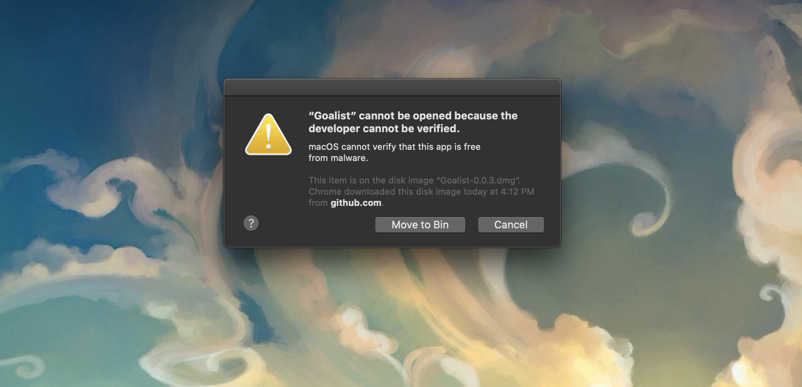
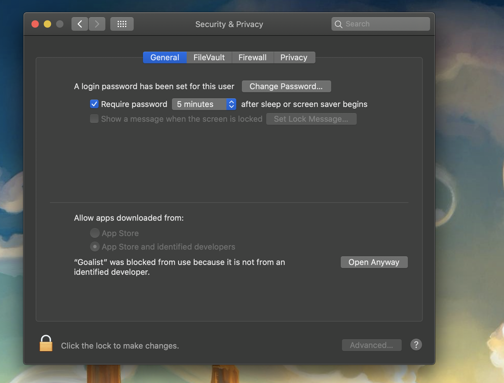

# Goalist

# Badges

# [Supported OS](#supported-os)

- Mac OS X 
- Linux ( AppImage )

# Download 

Head over to the [Releases](https://github.com/barelyhuman/goalist/releases) page to download the respective binary for the [Supported OS's](#supported-os)

# Installation

## Linux
   Most distributions should just run the `.AppImage` as it is but you might need to enable `Run as binary` for certain distros

## Mac OS X 
   - Try to open the app, it should give you a warning related to Unidenfied Developer. Hit Cancel on that.
    

   - Go into System Preferences > Security and Privacy > Open Anyway
    

